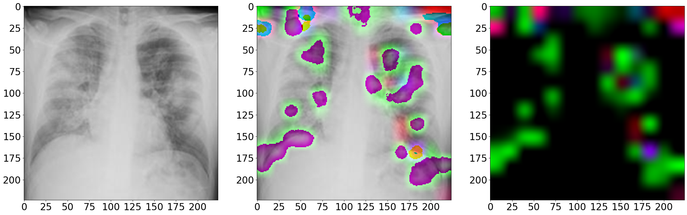
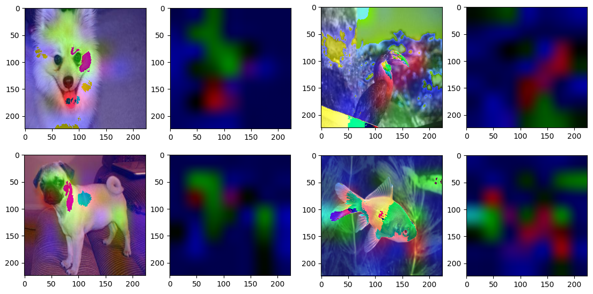
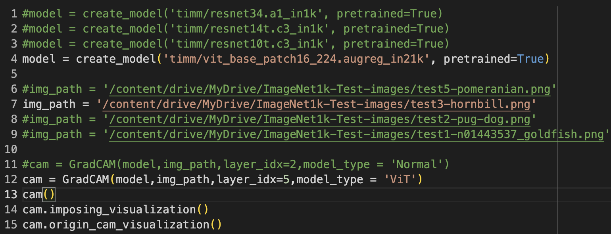
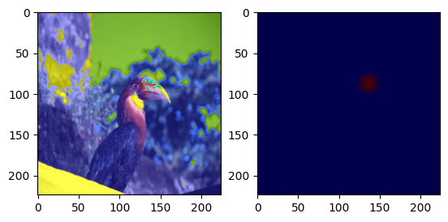
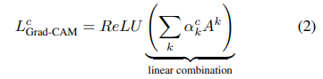
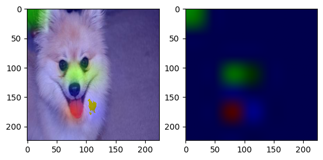
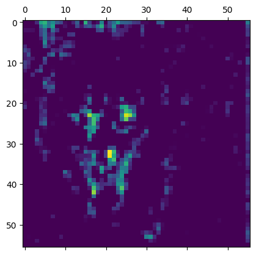
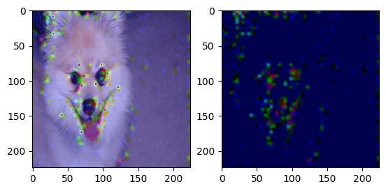

# Grad-CAM--Understand-deep-learning-from-higher-view
Gradient Class Activation Map: Visualize the model's prediction and can help you understand neural network models better

Thanks to Selvaraju's research: [Grad-CAM: Visual Explanations from Deep Networks via Gradient-based Localization](https://arxiv.org/abs/1610.02391), the code is developed on this research. <br>
The example code is in ```grad_cam_code/test.py```.
## Catalogue
* [How to use it](https://github.com/TyBruceChen/Grad-CAM--Understand-deep-learning-from-higher-view?tab=readme-ov-file#how-to-use-it)
* [Explanation](https://github.com/TyBruceChen/Grad-CAM--Understand-deep-learning-from-higher-view#explanation)
  * [Paper Explanation with Code](https://github.com/TyBruceChen/Grad-CAM--Understand-deep-learning-from-higher-view/tree/main#code-explanation)
  * [Practice Explanation (on ResNet34)](https://github.com/TyBruceChen/Grad-CAM--Understand-deep-learning-from-higher-view#practice-explanation-on-resnet34)
* [Application](https://github.com/TyBruceChen/Grad-CAM--Understand-deep-learning-from-higher-view/tree/main#application)
* [Future Works](https://github.com/TyBruceChen/Grad-CAM--Understand-deep-learning-from-higher-view/tree/main#future-works)
* [Debuggin Guidance](https://github.com/TyBruceChen/Grad-CAM--Understand-deep-learning-from-higher-view/tree/main#debugging-guidance)

This repository realizes Grad-CAM on Pytorch based models (pretrained models are from timm). To test the visualized results, I use ReseNet34 and ResNet10 models.

Required Libraries: Pytorch, matplotlib, torchvision, PIL, numpy

**Newly updated features:**
1. Now this Grad-CAM visualization code can process 1-d features (just convert gray image to RGB image)
2. After substituting the ReLU (which threshold is 0) with a adaptable threshold, the overlapped heatmap can have a more *'リアル' (real) image*, as shown below (this image is used in my [COVID-19 prediction research](https://github.com/TyBruceChen/Research-A-Fined-Tuned-ViT-for-COVID-19-Image-Auxiliary-Diagnosing)):



Example (on ResNet10) (The color from blue -> green -> red represents the focus of model on the picture low -> median -> high):



## How to use it:
```
from grad_cam import GradCAM

gradcam = GradCAM(model, img_path, layer_idx, input_size)  #initialize the GradCAM object
gradcam()  #call the object to form the heatmap array
gradcam.origin_cam_visualization()  #generate the GradCAM (without increasing the size of the heatmap)
gradcam.imposing_visualization()  #generate the overlapped graph and cam
```
For ViT models:



## Explanation:
### Code Explanation:
According to the explanation in [Grad-CAM paper](https://arxiv.org/abs/1610.02391): "Grad-CAM uses the gradient information flowing into the last convolutional layer of the CNN to assign importance values to each neuron for a particular decision of interest." 

#### Step 1: Gradients Back-propagation and Pooling 


where i and j are the height and width of the feature map. These two levels of summation correspond to the pooling step. Index k is one pixel's index from the heatmap after pooling

Get the activations at the specific layer and the prediction tensor at the specific category.
```
activations = extractor(img)
prediction_logits = classifier(activations)
#the activation is fed into rest layers (classifier) to get the prediction tensor
prediction_logits = prediction_logits[:,class_Idx]
```
Gradients back-propagation: gradient of classifier logits w.r.t. each (A_{i,j})logit from the feature extractor is calculated respectively, which results an output of the same shape as classifier ```logits[:,sepcified]```. 
```
prediction_logits.backward(gradient = grad_output)
d_act = activations.grad
```

Pooling along height and width of the activation map: Logits are pooled along height and weight. e.x.: (14,14,768) -> (14,14)
```
pooled_grads = torch.mean(d_act,dim = (0,1,2))
```

#### Step 2: Weighted Combination with Activation Maps



Combination of gradients and activations
```
for  i in range(d_act.shape[-1]):
      heatmap[:,:,i] *= pooled_grads[i]
heatmap = np.mean(heatmap, axis = -1) #shrink the channel number to 1
```

ReLU realization: keep the positive neurons that effect the final decision
```
np.maximum(heatmap,0)
```

### Practice Explanation (on ResNet34):
Let's see the Grad-CAM view of the last layer (layer_idx=2) before classifier first:


In the picture above, there are green and red colors on the Pomeranian's (the dog) face, which means the ResNet34 has successfully put its focus on the Pomeranian's face when the specified category type is the prediction it self.

How about the intermediate layer of the backbone's Grad-CAM view during the process of extracting features?

Let's see the model's architecture first:
```
ResNet(
  (conv1): Conv2d(3, 64, kernel_size=(7, 7), stride=(2, 2), padding=(3, 3), bias=False)
  (bn1): BatchNorm2d(64, eps=1e-05, momentum=0.1, affine=True, track_running_stats=True)
  (act1): ReLU(inplace=True)
  (maxpool): MaxPool2d(kernel_size=3, stride=2, padding=1, dilation=1, ceil_mode=False)
  (layer1): Sequential(
    (0): BasicBlock(
      (conv1): Conv2d(64, 64, kernel_size=(3, 3), stride=(1, 1), padding=(1, 1), bias=False)
      (bn1): BatchNorm2d(64, eps=1e-05, momentum=0.1, affine=True, track_running_stats=True)
      (drop_block): Identity()
      (act1): ReLU(inplace=True)
      (aa): Identity()
      (conv2): Conv2d(64, 64, kernel_size=(3, 3), stride=(1, 1), padding=(1, 1), bias=False)
      (bn2): BatchNorm2d(64, eps=1e-05, momentum=0.1, affine=True, track_running_stats=True)
      (act2): ReLU(inplace=True)
    )
    (1)...
    (2)...
  )
  (layer2): Sequential(
    ...
  )
  (layer3): Sequential(
    ...
  )
  (layer4): Sequential(
    ...
  )

  (global_pool): SelectAdaptivePool2d(pool_type=avg, flatten=Flatten(start_dim=1, end_dim=-1))
  (fc): Linear(in_features=512, out_features=1000, bias=True)
)
```

The ResNet34 is comprise from 1 shallow feature extractor, 4 residual blocks (deep feature extractor) and 1 linear layer (dense layer in tensorflow) (classifier).
Let layer_idx = 5, which means cropping the model between layer1 and layer2 to inspect the influence of layer1 (include layers before it) on the final decision.
Here's what I get from experiment:

The original heatmap shape by (56,56,1)




The merge of original image and CAM (heatmap)



From the experiment, we can conclude two things:
1. We can see that the resnet34 at layer1 already has the ability to extract the key feature from the experimented image (the red, green and yellow points plot the outline of the dog). If we concatenate the first half of the model directly with classifier (linear layer) to form a new model and train them with dog images like our tested one, it should have the same predicted category.
2. Comparing visual results under layer_idx=5 and layer_idx=2, we can see that, as the model goes deeper, the features that identify the category become more abstract.

## Application
Verify model's prediction, ensure proper blocks for specific dataset ...

## Future works:
```Currently, this code only works for activations that shape (B,H,W,C), where H,W should be greater than 1, which means for activation from MobileNet, EffcientNet, etc, it cannot work on their final layers and for ViT models which activations shape (B, sequence + 1 (class_token), 3*patch_size**2)``` The solution has been published.

## Debugging Guidance:
If you are not sure the layer number corresponding to the actual 'name' layer you want to truncate and display or meet error while using this code, like: ``` ValueError: too many values to unpack (expected 3) ```, try to use: 
```
extractor = nn.Sequential(*list(model.children())[:7])
extractor
```
If the compiler raises with error that there's no specific layer in your loaded model (trained on some pre-trained structures, e.x. in timm), like: ```'VisionTransformer' object has no attribute 'reg_tokens'```, check the version of your package which is used to construct the model and use ```pip install packagename==version```.

To show the actual layers with the extractor.

Author review only, debug online colab link: [Visualization Test](https://colab.research.google.com/drive/10XLnnOgjtpFebtSt3_lgWP5mNLwsuOq5#scrollTo=0jAu8Mi3JvHQ)

If you also want to access to this link, please email: ty_bruce.chen@outlook.com
